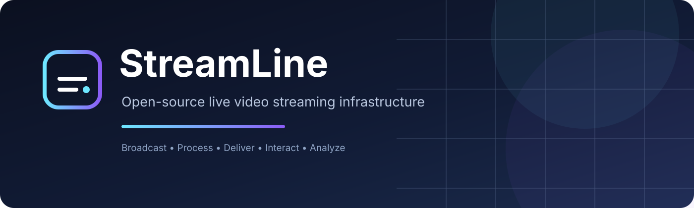
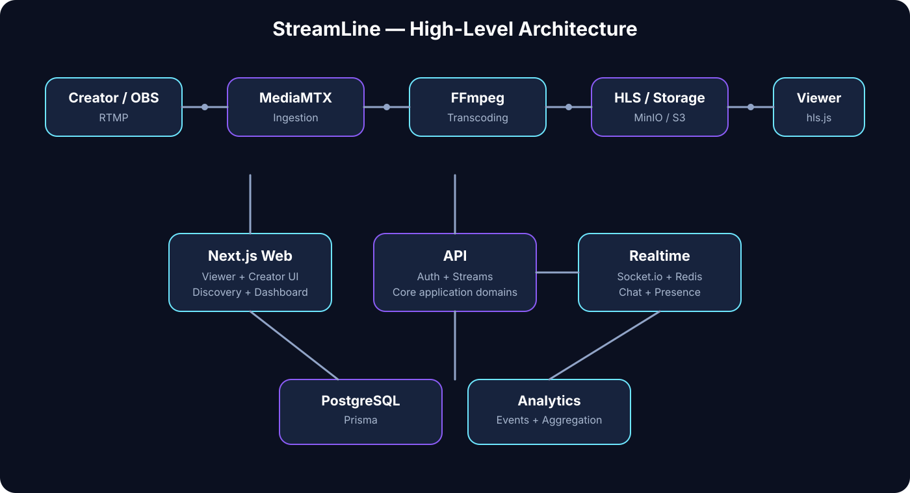

<div align="center">



<br/>

[](#project-status)
[](#technology)
[](#technology)
[](#license)

### Broadcast. Process. Deliver. Interact. Analyze.

**StreamLine is an open-source live video streaming infrastructure platform designed to demonstrate how modern streaming systems receive, process, distribute, and manage live experiences at scale.**

[Getting Started](#-getting-started) ·
[Architecture](#-architecture) ·
[Development](#-development) ·
[Contributing](CONTRIBUTING.md) ·
[Documentation](#-documentation)

</div>

---

## What is StreamLine?

StreamLine aims to provide a complete live streaming experience — not just a video player.

Creators should be able to broadcast live content while the platform handles the complexity of:

- Stream ingestion
- Live video processing
- Adaptive HLS playback
- Viewer experiences
- Real-time chat
- Community moderation
- Stream discovery
- Recording & VOD
- Creator analytics
- Notifications

The project is designed around the engineering challenges behind real streaming platforms: **reliability, performance, scalability, real-time communication, observability, and maintainability.**

---

## Project Goals

StreamLine is being built to demonstrate a production-quality streaming architecture that can evolve toward the scale described in the project requirements.

| Area | Target direction |
|---|---|
| Registered users | 100,000+ |
| Creators | 10,000+ |
| Simultaneous live streams | 500+ |
| Concurrent viewers | 50,000+ |
| Viewers per stream | 10,000+ |
| Chat | Millions of messages |
| Video processing | Thousands of segments/minute |
| Analytics | Millions of viewing events |
| Delivery | Real-time |

> These are **engineering targets from the project PRD**, not claims about the current system's capacity.

---

## Architecture

### High-level view



### Core streaming path

```text
Creator / OBS
      │
      │ RTMP
      ▼
  MediaMTX
      │
      ▼
   FFmpeg
      │
      ├── High quality
      ├── Medium quality
      └── Low quality
      │
      ▼
 HLS / Object Storage
      │
      ▼
 Browser + hls.js
```

### Application path

```text
                    ┌──────────────────┐
                    │    Next.js Web   │
                    │ Viewer + Creator │
                    └────────┬─────────┘
                             │
                             ▼
                    ┌──────────────────┐
                    │       API        │
                    │ Core application │
                    └───────┬──────────┘
                            │
                ┌───────────┼───────────┐
                ▼           ▼           ▼
           PostgreSQL     Redis      Services
             + Prisma                  │
                                      ├─ Media
                                      ├─ Realtime
                                      └─ Analytics
```

---

## Main Components

| Component | Responsibility |
|---|---|
| `apps/web` | Next.js web application, viewer experience, creator dashboard |
| `apps/api` | Core API and application/domain logic |
| `services/media/ingest` | Stream ingestion and MediaMTX integration |
| `services/media/transcoder` | FFmpeg processing and multi-quality HLS |
| `services/media/recorder` | Recording and VOD processing |
| `services/realtime` | Socket.io, WebSockets, chat and presence |
| `services/analytics` | Viewing and engagement analytics |
| `packages/database` | Prisma schema/client and database access |
| `packages/auth` | Authentication and authorization |
| `packages/types` | Shared TypeScript contracts |
| `packages/validation` | Shared request/data validation |
| `packages/ui` | Shared frontend UI components |
| `infrastructure` | PostgreSQL, Redis, MinIO, MediaMTX, FFmpeg and deployment infrastructure |

---

## ️ Technology

The initial architecture is built around:

### Web & Application

- **Next.js**
- **TypeScript**
- **Node.js**

### Data

- **PostgreSQL**
- **Prisma**
- **Redis**

### Media

- **MediaMTX**
- **FFmpeg**
- **HLS**
- **hls.js**
- **MinIO / S3-compatible storage**

### Realtime

- **Socket.io**
- **WebSockets**
- **Redis Pub/Sub**

### Repository

- **pnpm**
- **Turborepo-style monorepo**

> Technology choices may evolve as implementation progresses. Significant architectural changes should be recorded through an ADR in `docs/decisions/`.

---

##  Repository Structure

```text
streamline/
│
├── apps/
│   ├── web/                    # Next.js application
│   └── api/                    # Core API
│
├── services/
│   ├── media/
│   │   ├── ingest/             # RTMP / MediaMTX
│   │   ├── transcoder/         # FFmpeg / HLS
│   │   └── recorder/           # Recording / VOD
│   ├── realtime/               # Socket.io / chat / presence
│   └── analytics/              # Analytics processing
│
├── packages/
│   ├── database/               # Prisma / PostgreSQL
│   ├── auth/                   # Authentication / authorization
│   ├── config/                 # Shared configuration
│   ├── types/                  # Shared contracts
│   ├── validation/             # Validation schemas
│   ├── ui/                     # Shared UI
│   └── utils/                  # Domain-agnostic utilities
│
├── infrastructure/             # Runtime infrastructure
├── scripts/                    # Development/test/media/database scripts
├── tests/                      # Integration/E2E/load tests
├── docs/                       # Technical documentation
├── .github/                    # GitHub workflows/templates
│
├── AGENTS.md                   # AI agent instructions
├── CONTRIBUTING.md             # Contribution guidelines
├── README.md                   # Project overview
├── .env.example                # Environment variable template
├── package.json
├── pnpm-workspace.yaml
└── turbo.json
```

---

## Project Status

StreamLine is currently in **Phase 0 — Project Initialization**.

The planned progression is:

```text
Phase 0
Project Initialization
       │
       ▼
Phase 1
Foundations + HLS Proof of Concept
       │
       ▼
Phase 2
Live Ingest Pipeline
       │
       ▼
Phase 3
Viewer Experience + Creator Dashboard
       │
       ▼
Phase 4
Realtime Chat + Moderation
       │
       ▼
Phase 5
Recording + VOD + Analytics + Notifications
       │
       ▼
Phase 6
Polish + Load Testing + Documentation + Deployment
```

### Phase 1 milestone

The first media milestone is intentionally isolated:

```text
Local video
     ↓
FFmpeg
     ↓
Multi-quality HLS
     ↓
hls.js
```

The core Phase 2 unlock is:

```text
OBS
 ↓
MediaMTX
 ↓
FFmpeg
 ↓
HLS
 ↓
Browser
```

---

## Getting Started

> The exact setup commands will be finalized during Phase 0/Phase 1 initialization.

### Prerequisites

Expected local tooling:

- Node.js
- pnpm
- Docker / Docker Compose
- Git
- FFmpeg for local media testing

### Clone

```bash
git clone <repository-url>
cd streamline
```

### Install dependencies

```bash
pnpm install
```

### Environment

Create your local environment file from the example:

```bash
cp .env.example .env
```

Never commit `.env` or real credentials.

### Development

The final development command will be documented here once the application scaffolding is initialized.

---

## Team Ownership

StreamLine is initially being developed by a four-developer team.

| Area | Primary ownership |
|---|---|
| Core platform / backend / database | Developer 1 |
| Frontend / UI / viewer experience | Developer 2 |
| Media infrastructure / FFmpeg / MediaMTX | Developer 3 |
| Realtime / Redis / analytics / load testing | Developer 4 |

Ownership indicates the primary maintainer of an area; it does **not** prevent other contributors from making necessary changes.

The detailed task breakdown and phase plan will live in the project documentation.

---

## Documentation

The repository treats documentation as part of the engineering deliverable.

| Document | Purpose |
|---|---|
| [`AGENTS.md`](AGENTS.md) | Instructions and rules for AI coding agents |
| [`CONTRIBUTING.md`](CONTRIBUTING.md) | Human contributor workflow |
| [`docs/architecture/ARCHITECTURE.md`](docs/architecture/ARCHITECTURE.md) | System architecture and boundaries |
| [`docs/architecture/SYSTEM_FLOWS.md`](docs/architecture/SYSTEM_FLOWS.md) | System and data flows |
| [`docs/development/DEVELOPMENT.md`](docs/development/DEVELOPMENT.md) | Development practices |
| [`docs/development/GIT_WORKFLOW.md`](docs/development/GIT_WORKFLOW.md) | Branches, commits and PRs |
| [`docs/api/API_GUIDELINES.md`](docs/api/API_GUIDELINES.md) | API conventions |
| [`docs/database/DATABASE.md`](docs/database/DATABASE.md) | Database guidelines |
| [`docs/streaming/STREAMING.md`](docs/streaming/STREAMING.md) | Media and streaming architecture |
| [`docs/realtime/REALTIME.md`](docs/realtime/REALTIME.md) | WebSocket/chat/realtime architecture |
| [`docs/decisions/ADR_TEMPLATE.md`](docs/decisions/ADR_TEMPLATE.md) | Architecture Decision Record template |

---

## Contributing

We want StreamLine to remain easy to understand and contribute to.

Before contributing:

1. Read [`CONTRIBUTING.md`](CONTRIBUTING.md).
2. Read [`AGENTS.md`](AGENTS.md) if using an AI coding agent.
3. Check the relevant documentation.
4. Create a focused branch.
5. Make a focused change.
6. Add/update tests.
7. Update documentation when necessary.
8. Open a reviewable pull request.

### Commit style

```text
feat: add stream creation
fix: handle stream reconnect
refactor: simplify viewer presence
test: add chat fan-out tests
docs: document HLS pipeline
chore: update development tooling
```

---

## Security

Security is a core engineering requirement.

Never commit:

- passwords
- API keys
- access tokens
- private credentials
- production secrets

Server-side authorization must not trust client-provided:

- roles
- ownership
- moderator permissions
- stream status

Security issues should be reported privately to the project maintainers rather than disclosed publicly in an issue.

---

## Testing Philosophy

StreamLine will eventually require testing at multiple levels:

```text
Unit
  ↓
Integration
  ↓
End-to-End
  ↓
Load / Performance
```

Particular attention will be given to failure scenarios in:

- live stream ingestion
- creator disconnect/reconnect
- FFmpeg processing
- HLS availability
- WebSocket connections
- chat fan-out
- viewer presence
- analytics ingestion

A feature is not considered production-ready merely because it compiles.

---

## Engineering Principles

StreamLine follows a few simple principles:

### 1. Correctness before complexity

Build the correct system before optimizing it.

### 2. Clear ownership

Every feature should have an obvious home.

### 3. Shared contracts

Frontend, backend, and services should communicate through explicit contracts.

### 4. Failure is normal

Networks disconnect. Processes crash. Streams stop. Users reconnect.

Design for it.

### 5. Scale consciously

The project has ambitious scale targets, but we should not introduce unnecessary distributed-system complexity before it is justified.

### 6. Documentation is code

If an architectural decision is important enough to affect other developers, document it.

### 7. Small, reviewable changes

Prefer focused PRs over massive changes that are difficult to review.

---

## Roadmap

### Phase 0 — Initialization

- [x] Repository structure
- [x] Documentation foundation
- [x] Agent instructions
- [ ] Final architecture decisions
- [ ] Team ownership/task plan
- [ ] Development environment

### Phase 1 — Foundations & HLS POC

- [ ] Next.js scaffolding
- [ ] Prisma scaffolding
- [ ] Authentication
- [ ] `User` / `Stream` / `Follow` schema
- [ ] PostgreSQL
- [ ] Redis
- [ ] MinIO
- [ ] Docker Compose
- [ ] Standalone FFmpeg HLS proof
- [ ] Multi-quality playback with hls.js

### Phase 2 — Live Ingest

- [ ] MediaMTX
- [ ] RTMP from OBS
- [ ] FFmpeg worker pipeline
- [ ] HLS output
- [ ] MinIO integration
- [ ] Stream key generation
- [ ] Stream page playback
- [ ] End-to-end OBS → browser flow

### Phase 3 — Viewer & Creator

- [ ] Live stream discovery
- [ ] Viewer counting
- [ ] Creator dashboard
- [ ] Stream lifecycle handling
- [ ] Disconnect/reconnect handling

### Phase 4 — Realtime

- [ ] Socket.io server
- [ ] Redis Pub/Sub
- [ ] Chat
- [ ] Chat persistence
- [ ] Moderation
- [ ] Timeout
- [ ] Moderator roles

### Phase 5 — VOD, Analytics & Notifications

- [ ] Recording
- [ ] VOD manifests
- [ ] Viewer analytics
- [ ] Peak viewers
- [ ] Chat activity analytics
- [ ] Follow → go-live notifications

### Phase 6 — Hardening & Deployment

- [ ] Concurrent viewer testing
- [ ] Stream simulation
- [ ] Load testing
- [ ] Production deployment
- [ ] Architecture documentation
- [ ] API documentation
- [ ] Deployment documentation
- [ ] Contribution hardening
- [ ] Production fixes

---

## What Success Looks Like

StreamLine succeeds when:

- creators can reliably broadcast content
- viewers can watch streams smoothly
- communities can interact in real time
- stream history remains accessible
- creators understand their audience
- the architecture is production-quality
- the codebase is easy to contribute to
- the system can be tested under realistic load

---

##  License

License: **TBD**

---

<div align="center">

### Built to understand streaming from the inside out.

**StreamLine · Open Source · Live Video Infrastructure**

</div>
